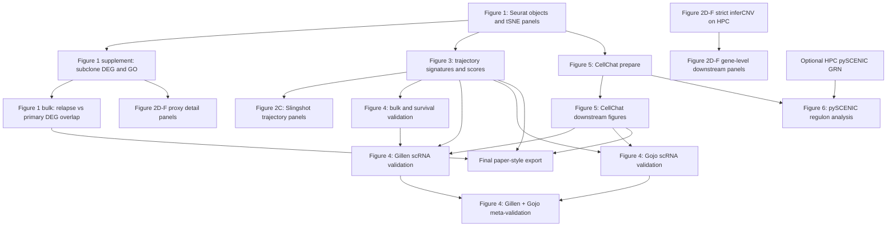

# 复现脚本运行顺序

本文档只描述当前主流程脚本的先后依赖。所有命令默认从工作区根目录运行；如果终端不在工作区根目录，请先切到本仓库根目录。

如果已有对应输出，可以跳过重跑；很多脚本会优先读取 `output/` 中的缓存或中间结果。

## 1. 总体依赖图



文字版依赖关系：

```text
Figure 1 Seurat/tSNE objects
  -> Figure 1 supplements and bulk DEG
  -> Figure 3 trajectory signatures
       -> Figure 2C trajectory panels
       -> Figure 4 survival and external validation
  -> Figure 5 CellChat prepare
       -> Figure 5 CellChat downstream figures
       -> Figure 6 pySCENIC input and regulon analysis

Figure 5 readable outputs + Figure 4 bulk LR stats
  -> Figure 4 external scRNA key ligand/receptor panels

Gillen scRNA outputs + Gojo scRNA outputs
  -> Figure 4 external scRNA meta-validation
```

最核心的主干是：先跑 Figure 1 生成 Seurat RDS，再跑 Figure 3 生成 trajectory signature；后面的 Figure 2、4、5、6 都依赖这两层结果中的一部分。

## 2. 基础环境和数据准备

通常只需要确认环境已经存在，不需要每次都重建。

```bash
bash projectmd/setup_install_python_extras.sh
```

pySCENIC 需要 cisTarget 数据库。只有 `output/fig6/cistarget/` 缺文件时才运行：

```bash
bash projectmd/setup_cistarget_databases.sh
```

## 3. 本地主流程推荐顺序

### 3.1 Figure 1 基础对象和 tSNE 图

这是全项目最先跑的一步。它会生成四个样本的 Seurat RDS，后续 Figure 2、3、5 都会读取。

```bash
conda run -n epn2_r Rscript projectmd/fig01_tsne_cnv_cytotrace_seurat.R
```

关键输出：

```text
output/fig1/GTE001_seurat.rds
output/fig1/GTE002_seurat.rds
output/fig1/GTE009_seurat.rds
output/fig1/GTE012_seurat.rds
output/fig1/GTE00*_tsne_panels.pdf
```

### 3.2 Figure 1 补充分析和 bulk 对照

先跑 GTE009 subclone DEG/GO，再跑 bulk relapse-vs-primary DEG 对照。

```bash
conda run -n epn2_r Rscript projectmd/fig01_supp_subclone_deg_go.R
conda run -n epn2_r Rscript projectmd/fig01_bulk_relapse_deg.R
```

依赖关系：

```text
fig01_supp_subclone_deg_go.R 需要 output/fig1/GTE009_seurat.rds
fig01_bulk_relapse_deg.R     需要 output/fig1_supp/GTE009_Sub1vs2_DEG.csv
```

### 3.3 Figure 3 trajectory signature

这一步从 GTE009 subclone DEG 和细胞状态 marker 推出未分化/分化 signature，并给四个样本打 trajectory score。Figure 4 的 bulk/scRNA validation 主要依赖这里的 signature。

```bash
conda run -n epn2_r Rscript projectmd/fig03_subclone_undiff_diff_score.R
```

关键输出：

```text
output/fig3/trajectory_signatures.rds
output/fig3/undiff_genes.txt
output/fig3/diff_genes.txt
output/fig3/GTE00*_scores.rds
```

### 3.4 Figure 2 trajectory 和 CNV 相关面板

建议在 Figure 3 之后跑 Figure 2C final panel，因为 final panel 会尝试读取 `output/fig3/GTE009_scores.rds` 来整合 trajectory score。

```bash
conda run -n epn2_r Rscript projectmd/fig02_slingshot_basic.R
conda run -n epn2_r Rscript projectmd/fig02c_slingshot_final_panel.R
```

如果只要最终图，`fig02c_slingshot_final_panel.R` 是更重要的脚本；`fig02_slingshot_basic.R` 是基础版结果，适合复核 slingshot 本身。

在没有 gene-level inferCNV 矩阵时，可跑 proxy detail panels：

```bash
conda run -n epn2 python projectmd/fig02_detail_proxy_panels.py
```

strict inferCNV 是重任务，推荐按 [hpc/README.md](hpc/README.md) 在 WHU HPC 上运行。逻辑顺序是：

```text
fig02_infercnv_build_gene_order.py
  -> fig02_infercnv_run_gte009.R
  -> fig02_infercnv_genelevel_panels.R
```

本地已有 HPC 拉回结果时，只需跑下游绘图：

```bash
conda run -n epn2_r Rscript projectmd/fig02_infercnv_genelevel_panels.R
```

### 3.5 Figure 5 CellChat

先准备稀疏整合对象和 CellChat object，再跑下游 fullsize/readable 图。

```bash
conda run -n epn2_r Rscript projectmd/fig05_cellchat_prepare.R
conda run -n epn2_r Rscript projectmd/fig05_cellchat_downstream.R
```

依赖关系：

```text
fig05_cellchat_prepare.R    需要 output/fig1/GTE00*_seurat.rds
fig05_cellchat_downstream.R 需要 output/fig5/cellchat_merged.rds
```

`fig05_cellchat_prepare.R` 同时会写出 pySCENIC 输入矩阵：

```text
output/fig6/scenic_input/integrated_logmat.rds
```

### 3.6 Figure 6 pySCENIC

pySCENIC 依赖 Figure 5 prepare 步骤导出的 `integrated_logmat.rds`。如果本地资源足够，可以直接跑：

```bash
conda run -n epn2 python projectmd/fig06_pyscenic_run.py
conda run -n epn2 python projectmd/fig06_pyscenic_downstream.py
```

如果 GRN 已经在 HPC 或其他机器跑完，只需要从 `adj.tsv` 继续 ctx + aucell + 下游图：

```bash
bash projectmd/fig06_scenic_ctx_aucell_pipeline.sh
```

更多 HPC 运行说明见 [hpc/README.md](hpc/README.md)。

### 3.7 Figure 4 survival 和外部验证

Figure 4 建议放在 Figure 3、Figure 5 之后跑：Figure 3 提供 trajectory signature；Figure 5 readable 输出会给外部 scRNA LR panel 补充 ligand/receptor 候选。

先跑 bulk/microarray/survival：

```bash
conda run -n epn2_r Rscript projectmd/fig04_bulk_relapse_proxies.R
conda run -n epn2_r Rscript projectmd/fig04_gillen_microarray_proxy.R
conda run -n epn2_r Rscript projectmd/fig04_gillen_survival_km.R
```

再跑 Gillen GSE125969 scRNA validation：

```bash
conda run -n epn2 python projectmd/fig04_gillen_scrna_validation.py
conda run -n epn2 python projectmd/fig04_gillen_scrna_pseudobulk_lr.py
conda run -n epn2_r Rscript projectmd/fig04_gillen_scrna_deg_go.R
```

再跑 Gojo GSE141460 scRNA validation：

```bash
conda run -n epn2 python projectmd/fig04_gojo_scrna_validation.py
conda run -n epn2_r Rscript projectmd/fig04_gojo_scrna_deg_go.R
```

最后跑 Gillen + Gojo 的低内存 meta-validation：

```bash
conda run -n epn2 python projectmd/fig04_external_scrna_meta_validation.py
```

可选的 Pajtler/cBioPortal 模板不属于当前主线。只有拿到外部 cBioPortal 数据后才运行：

```bash
conda run -n epn2_r Rscript projectmd/cohort_prepare_pajtler_template.R
conda run -n epn2_r Rscript projectmd/fig04_survival_template.R
```

### 3.8 最终论文风格导出

这一步把已有结果重新整理成更接近论文风格的图，不生成新的生物学中间结果。建议放在 Figure 1、Figure 3、Figure 1 bulk 完成后，或直接作为最后一步运行。

```bash
conda run -n epn2_r Rscript projectmd/final_paper_style_export.R
```

## 4. 最小重跑路线

如果只是想从头复习主线，不重跑 HPC/inferCNV 和 pySCENIC 重任务，可以按下面顺序：

```bash
conda run -n epn2_r Rscript projectmd/fig01_tsne_cnv_cytotrace_seurat.R
conda run -n epn2_r Rscript projectmd/fig01_supp_subclone_deg_go.R
conda run -n epn2_r Rscript projectmd/fig01_bulk_relapse_deg.R
conda run -n epn2_r Rscript projectmd/fig03_subclone_undiff_diff_score.R
conda run -n epn2_r Rscript projectmd/fig02c_slingshot_final_panel.R
conda run -n epn2_r Rscript projectmd/fig05_cellchat_prepare.R
conda run -n epn2_r Rscript projectmd/fig05_cellchat_downstream.R
conda run -n epn2_r Rscript projectmd/fig04_bulk_relapse_proxies.R
conda run -n epn2_r Rscript projectmd/fig04_gillen_survival_km.R
conda run -n epn2 python projectmd/fig04_gillen_scrna_validation.py
conda run -n epn2 python projectmd/fig04_gillen_scrna_pseudobulk_lr.py
conda run -n epn2_r Rscript projectmd/fig04_gillen_scrna_deg_go.R
conda run -n epn2 python projectmd/fig04_gojo_scrna_validation.py
conda run -n epn2_r Rscript projectmd/fig04_gojo_scrna_deg_go.R
conda run -n epn2 python projectmd/fig04_external_scrna_meta_validation.py
conda run -n epn2_r Rscript projectmd/final_paper_style_export.R
```

## 5. 不在当前主线中重跑的部分

```text
Figure 2B RNA velocity: 缺少 10x BAM，当前跳过。
Supp Fig 2 WES CNVkit: 缺少 WES fastq，当前跳过。
Monocle2 DDRTree: 当前 R 4.4 环境不稳定，主线使用 Slingshot 替代。
```
