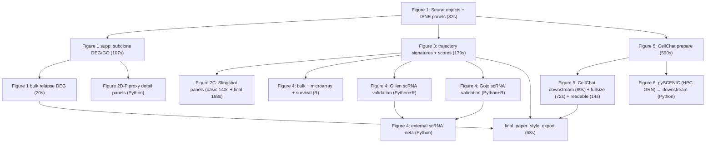

# v2 复现脚本运行顺序

> v2 版与 [`projectmd/RUN_ORDER.md`](../RUN_ORDER.md) 依赖图一致；本文件仅替换路径与命令为 v2，并标注本地实跑通过的耗时。
>
> v2 写出口：`output/v2/figX/...`。读上游：`dep_file()` 自动 v2 → v1 回落，**单独跑任意脚本都不用先重建上游**。
>
> HPC 脚本（inferCNV strict / pySCENIC GRN）保留 v1 路径，未做 v2。

## 1. 总体依赖图



## 2. 环境 / 数据准备

```bash
bash projectmd/v2/setup_install_python_extras.sh           # idempotent
bash projectmd/v2/setup_cistarget_databases.sh             # 仅 fig6/cistarget 缺时
```

## 3. 推荐顺序（本地）

> 实测耗时 ⌚ 来自 `output/v2/_runtime_logs/summary.tsv`（M 级 WSL）。

### 3.1 Figure 1 — 基础对象 ⌚32s
```bash
conda run -n epn2_r Rscript projectmd/v2/fig01_tsne_cnv_cytotrace_seurat.R
```
关键产物：`output/v2/fig1/GTE00*_tsne_panels.pdf`（Seurat RDS 仍走 v1 缓存）。

### 3.2 Figure 1 补充 + bulk ⌚107s + 20s
```bash
conda run -n epn2_r Rscript projectmd/v2/fig01_supp_subclone_deg_go.R
conda run -n epn2_r Rscript projectmd/v2/fig01_bulk_relapse_deg.R
```

### 3.3 Figure 3 — trajectory signature ⌚179s
```bash
conda run -n epn2_r Rscript projectmd/v2/fig03_subclone_undiff_diff_score.R
```
产物：`output/v2/fig3/{trajectory_signatures.rds, undiff_genes.txt, diff_genes.txt, GTE00*_scores.rds}`。

### 3.4 Figure 2 trajectory ⌚140s + 168s
```bash
conda run -n epn2_r Rscript projectmd/v2/fig02_slingshot_basic.R
conda run -n epn2_r Rscript projectmd/v2/fig02c_slingshot_final_panel.R   # 论文用
conda run -n epn2  python  projectmd/v2/fig02_detail_proxy_panels.py      # proxy 面板
```
strict inferCNV 仍按 HPC 流程：
```text
fig02_infercnv_build_gene_order.py  → fig02_infercnv_run_gte009.R  → fig02_infercnv_genelevel_panels.R
```

### 3.5 Figure 5 CellChat ⌚590s + 89s + 72s + 14s
```bash
conda run -n epn2_r Rscript projectmd/v2/fig05_cellchat_prepare.R
conda run -n epn2_r Rscript projectmd/v2/fig05_cellchat_downstream.R
conda run -n epn2_r Rscript projectmd/v2/fig05_cellchat_fullsize_figures.R
conda run -n epn2_r Rscript projectmd/v2/fig05_cellchat_readable_figures.R
```
prepare 步骤同时写出 pySCENIC 输入：`output/v2/fig6/scenic_input/integrated_logmat.rds`。

### 3.6 Figure 6 pySCENIC（HPC GRN + 本地 downstream）
```bash
# GRN（HPC，未 v2 化）：
conda run -n epn2 python projectmd/fig06_pyscenic_run.py
bash projectmd/fig06_scenic_ctx_aucell_pipeline.sh
# 本地下游：
conda run -n epn2  python  projectmd/v2/fig06_pyscenic_downstream.py
```

### 3.7 Figure 4 — 外部验证

Bulk / microarray / survival ⌚22s + 10s + 14s + 3s + 25s + 35s
```bash
conda run -n epn2_r Rscript projectmd/v2/fig04_bulk_relapse_proxies.R
conda run -n epn2_r Rscript projectmd/v2/fig04_gillen_microarray_proxy.R
conda run -n epn2_r Rscript projectmd/v2/fig04_gillen_survival_km.R
conda run -n epn2_r Rscript projectmd/v2/fig04_survival_template.R
conda run -n epn2_r Rscript projectmd/v2/fig04_gojo_scrna_deg_go.R
conda run -n epn2_r Rscript projectmd/v2/fig04_gillen_scrna_deg_go.R
```

scRNA validation（Python，依赖外部 GSE 缓存）：
```bash
conda run -n epn2 python projectmd/v2/fig04_gillen_scrna_validation.py
conda run -n epn2 python projectmd/v2/fig04_gillen_scrna_pseudobulk_lr.py
conda run -n epn2 python projectmd/v2/fig04_gojo_scrna_validation.py
conda run -n epn2 python projectmd/v2/fig04_external_scrna_meta_validation.py
```

外部 cohort 模板（需先放原始数据到 `projectfile/external_cohort/<COHORT>/`）：
```bash
conda run -n epn2_r Rscript projectmd/v2/cohort_prepare_pajtler_template.R
```

### 3.8 论文风格统一导出 ⌚63s
```bash
conda run -n epn2_r Rscript projectmd/v2/final_paper_style_export.R
```

## 4. 一键全跑

```bash
TIMEOUT=900 bash projectmd/v2/_run_all_R.sh
# 顺序跑 18 个 R，单脚本日志 → output/v2/_runtime_logs/<name>.log
# 总耗时约 30 分钟（最重 fig05_cellchat_prepare ~10 分钟）
```

## 5. 实跑历史（截至本次会话）

| 类别 | 通过 | 失败（原因） |
|---|---|---|
| 6 Python | importlib OK；2 个 e2e（external_scrna_meta、pyscenic_downstream） | — |
| 18 R | **17/18 PASS** | cohort_prepare（缺 `projectfile/external_cohort/Pajtler2015/`，预期） |
| 2 shell | bash -n OK | — |

详见 [V2_REFACTOR_REPORT.md](V2_REFACTOR_REPORT.md) §5。
